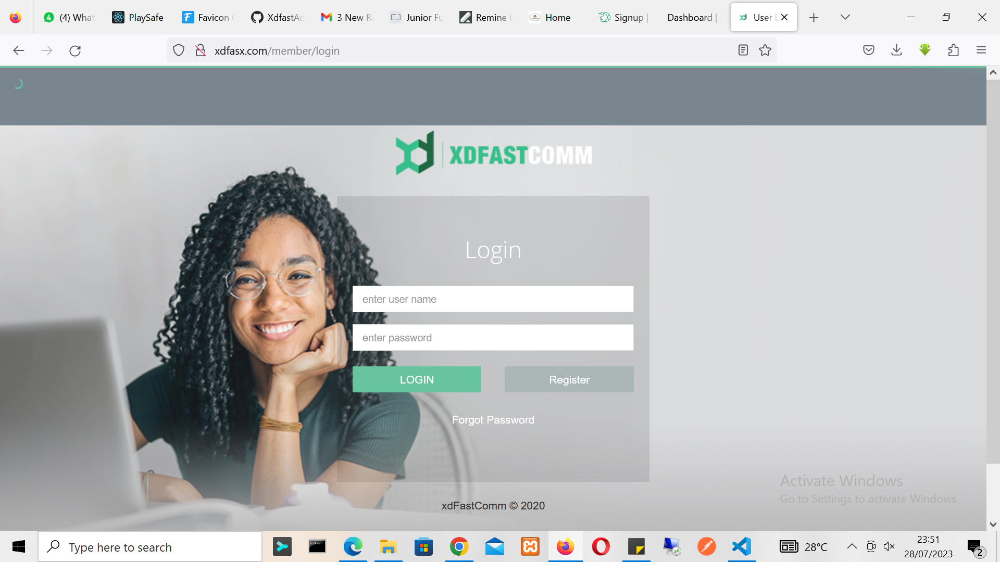
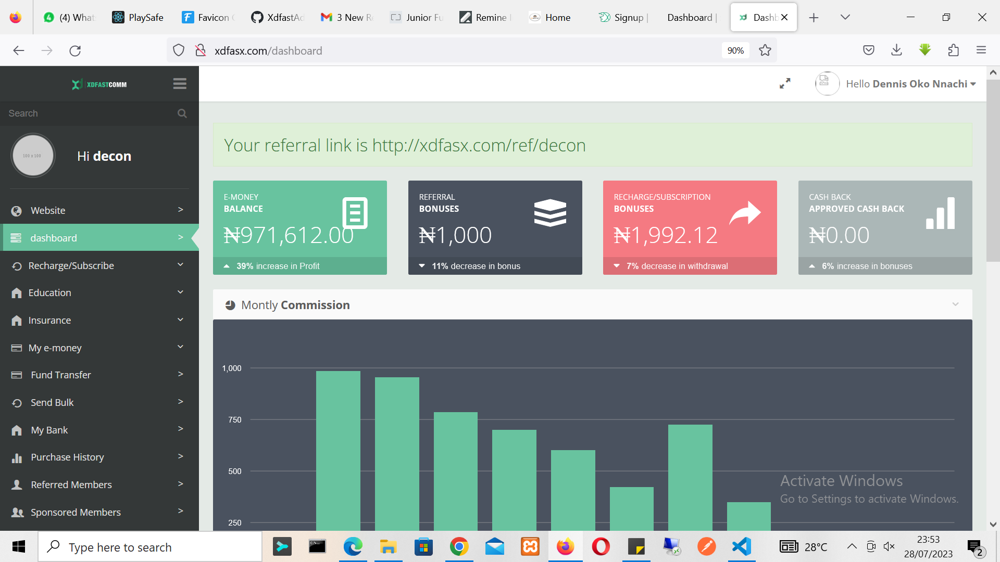
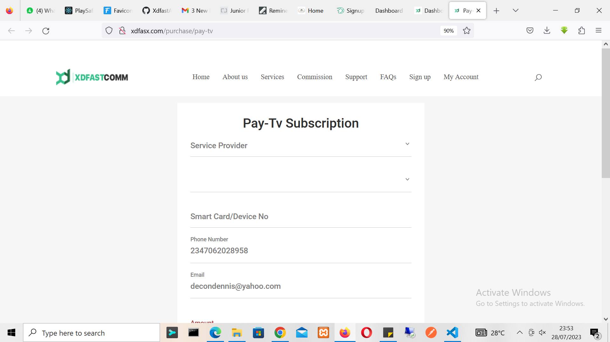
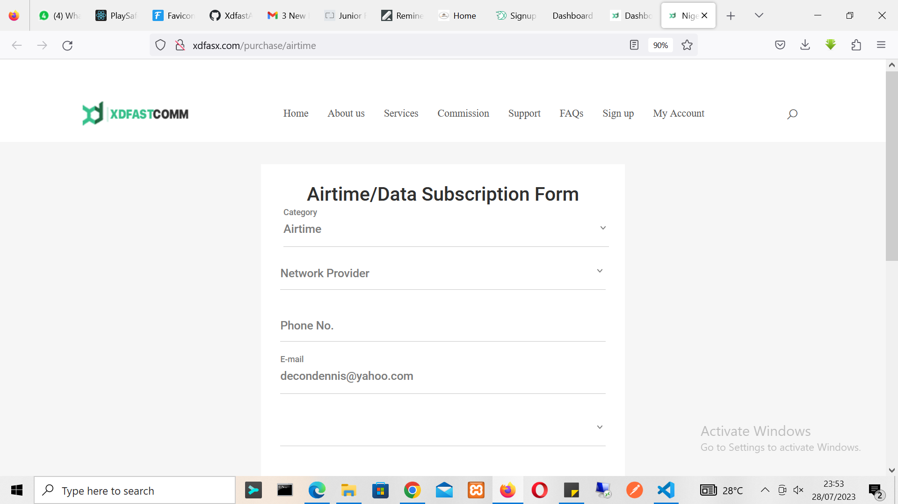
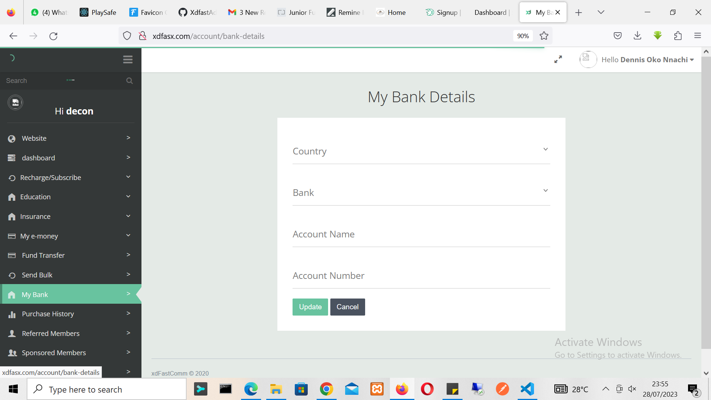
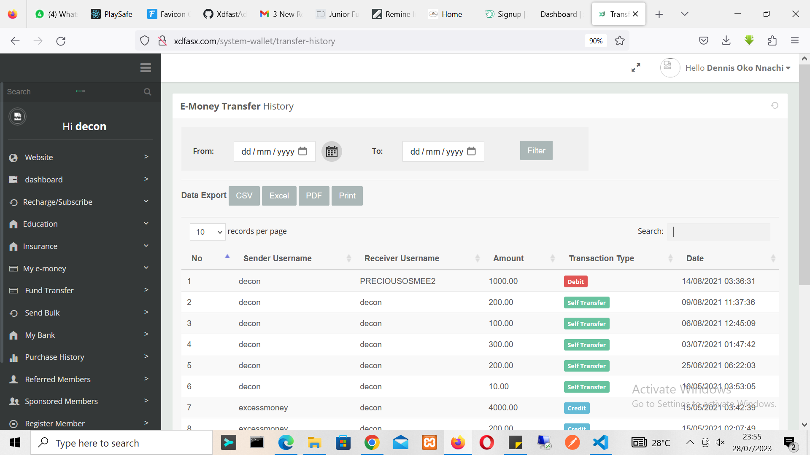
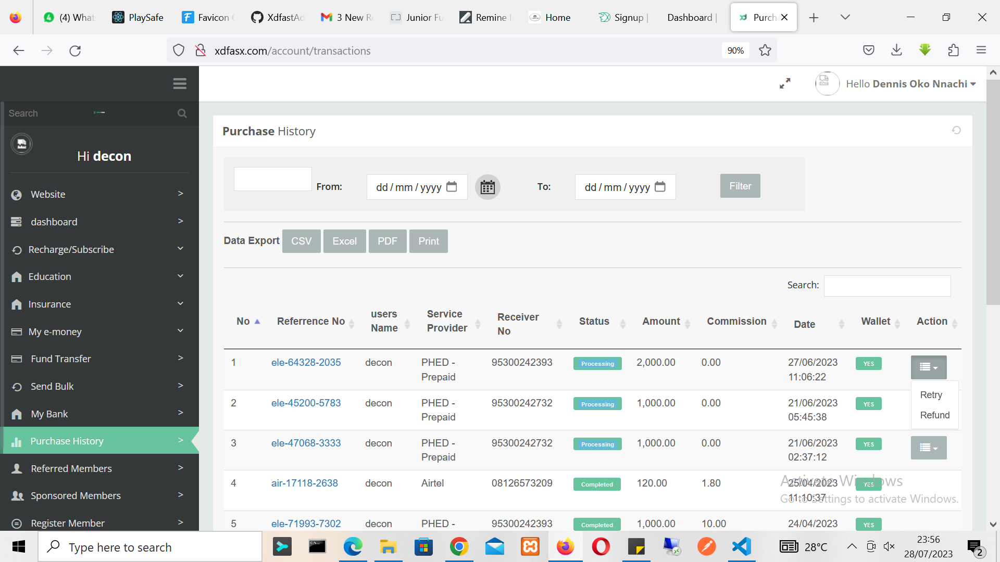
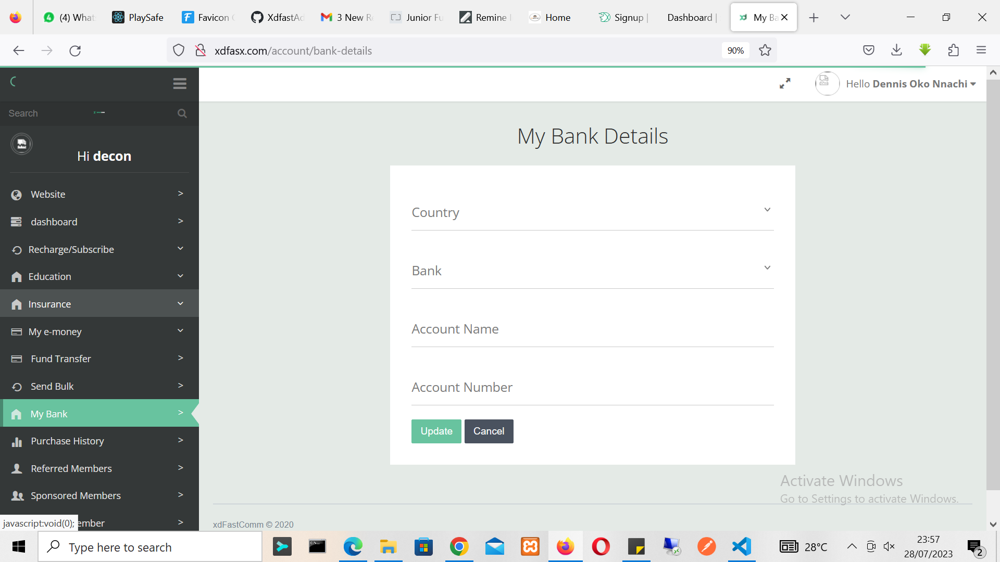

## XDFastCommAdmin: A Comprehensive Web Application for Transaction Management

XDFastCommAdmin is a powerful and versatile web application designed to facilitate seamless transaction management for both users and administrators of XDFastComm. With an intuitive and user-friendly interface, the app empowers users to efficiently handle a wide range of transactions with ease.

## Key Features:

    Dashboard: The app's dashboard serves as the central hub for users and administrators, providing an overview of critical information and access to various functionalities.

    Akawo Management: XDFastCommAdmin includes a dedicated section for Akawo management, encompassing features like Akawo Dashboard, Akawo e-money, Akawo Package, Fund Withdrawal, Buy e-money, Emergency Withdrawal, and more.

    Recharge/Subscribe: Users can easily recharge and subscribe to services like airtime/data, PayTv, and electricity from within the app.

   ## Purchase History: 
   XDFastCommAdmin keeps a detailed record of users' purchase history, ensuring transparency and easy reference.

    My e-money: The app enables users to manage their e-money, perform purse transfers, e-money transfers, view transaction history, and monitor their purse balance.

   ## Member Management: 
   XDFastCommAdmin facilitates efficient management of sponsored and referred members, empowering users to track and grow their network.

    Fund Cashback: Users can request and monitor cashback transactions, with features like Cashback Request, Pending Requests, and Cashback History.

    My Bank: The app provides a secure platform for users to manage their banking details and transactions.

    Flight Booking: Users can conveniently book flights through XDFastCommAdmin, streamlining travel arrangements.

    Fund Transfer: The app offers hassle-free fund transfer capabilities, ensuring smooth financial transactions.

    Registration: New users can easily register through the app, opening the door to a world of convenient services.

## Technology Stack:

XDFastCommAdmin has been built using a robust and modern technology stack to deliver optimal performance and a seamless user experience. The technology stack includes:

   ## HTML and CSS: 
   Providing the foundation for the app's layout and visual design.

    JavaScript: Powering interactivity and dynamic elements for enhanced user engagement.

    Bootstrap: Ensuring a responsive and mobile-friendly design, accessible across various devices.

    Font Awesome Icons: Enhancing the app's visual representation and user interface.
    Laminas Framework Stack: This includes various Laminas modules and components used to build the application.
    Doctrine ORM and PHP.

XDFastCommAdmin is your ultimate solution for streamlined transaction management, empowering users to handle various services and transactions efficiently. Whether you're an individual seeking convenience or an administrator managing operations, XDFastCommAdmin caters to your needs with its feature-rich and user-centric design. www.xdfasx.com

